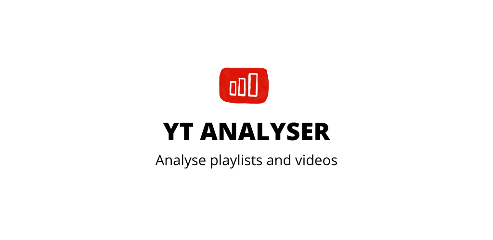

# yt-analyser

Shows youtube playlist durations in one click

## Features

- Share a URL directly or paste Youtube URL video
- Offline caching
- Dark mode support

## Technologies Used

- Youtube Data API
- Retrofit
- kotlinx.serialization
- Jetpack Compose
- Compose Navigation
- Material 3
- Coil
- Coroutines
- MVVM
- Room Database

## Screenshots

TBF

## Setup

TBF

## Contributing

TBF

## Licence

TBF